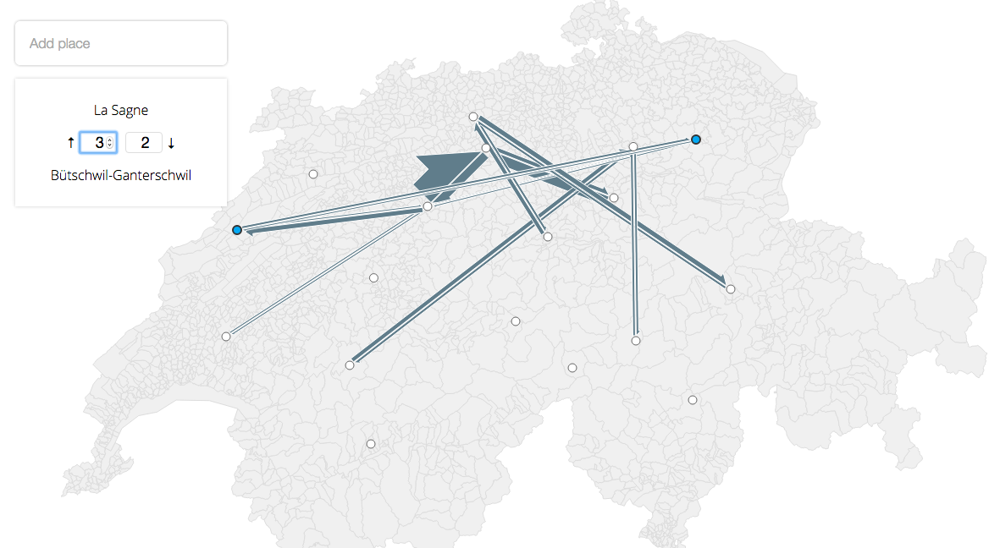

# React + Redux + D3 flowlines



## Thoughts and lessons learned

**Data:** I used mostly `GeoJSON` as the internal format for the geographical features, so
that the graph would make sense if merged into one output, so flowlines are
graph edges with connections and weights in their properties. TopoJSON was used
to load the huge cantones boundaries file.

For the **application structure and Redux** - I'm quite happy with the data flow,
but maybe due to the fact that the methodology is quite new to me, I couldn't
figure out, where to put the code for extracting the initial flowline data from
the app state. So I have similar code for updating the state in the reducers,
but do I have to put the retrieval code there and how - it's not very clear for
me. Also most of the operations are updating the app state, I wish I could clone
it to maintain undo/redo and sync with the server, but it's not really in the
scope here

Using **React** for the UI was extremely convenient, I mean search, form, layout -
all of that was done in no time thanks to React. However, the rendering
of features and interacting with them was super-uncomfortable. I saw
unnecessary renders, problems in state management, event delegation is
difficult, and I see a horrible hicckup in the click-to-add-point behaviour,
which I'll have to investigate to understand what is causing such a delay.
Also, I would be able to do the same task with raw Leaflet, maybe even with
canvas rendering in 1/4 of the time I spent here and maybe feel more confident
I can make it better. But I guess that could be my ignorance and it would be
also interesting to improve the performance on this one.

Also now I don't really understand why I had to use such a huge dataset for the
basemap, I would even consider using that one pre-rendered.


## Run

```shell
$ npm start && open http://localhost:8080/
```


## Build

```shell
    npm run build
```
